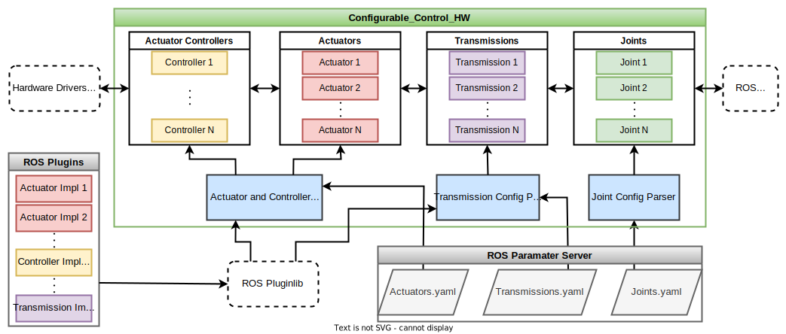

# The Configurable Control Hardware framework

A [Robot Operating System](https://www.ros.org/) (ROS) framework for managing the hardware resources of a robot: actuators, transmissions and joints. This framework is meant to be used alongside the ROS Control framework.

---
&nbsp;&nbsp;&nbsp;&nbsp;&nbsp;&nbsp;&nbsp;&nbsp;&nbsp;&nbsp;&nbsp;&nbsp;

---

## Introduction

The ROS Control framework requires the user to implement a RobotHW interface for every robot. An implementation should incorporate and manage all the hardware resources of the robot and perform read/write to/from actuators and sensors.

Complete details of the RobotHW interface and it's implementations can be found in the [ROS Control documentation](http://wiki.ros.org/ros_control). In summary, the RobotHW interface acts as intermediary between ROS Controllers and the actual actuator hardware. For a robot with a single joint and actuator, the workflow is as follows:

While this is trivial for a single joint robot, for real-world robots, implementing all the functionality into a single class can become challenging. Such a class can also prove difficult to maintain. Any change to the robot configuration or to the hardware resource implementation can be difficult to implement.

## Configurable Control HW

The Configurable Control HW framework is aimed at solving the problem mentioned above. It provides a complete implementation of the RobotHW class, but using abstract versions of the hardware rsources. This allows for decoupling the RobotHW implementation, from the robot's configuration as well as concrete implementations of different hardware resources.

The RobotHW implementation in this framework applies the previously described workflow for RobotHW, using abstractions for joints, tranmissions and actuators. The required implementations for these resources have to be specified as runtime configuration(YAML files).

ROS [Pluginlib](http://wiki.ros.org/pluginlib) serves as the service locator for locating and loading the required implementation libraries at runtime. The concrete implementations of the hardware resources are in the form of ROS Plugins. Config parsers for each type of hardware resource, parse the YAML config to identify the required implementations. This information is then used by the parser to load the required libraries using pluginlib. The loaded libraries contain implementation specific config parsers, which read the parameters from the YAML config, create and configure the required hardware resource objects accordingly. Essentially the config parsers loaded by pluginlib serve as factories for creating the required hardware resource objects.

### Features:
- Easy to reconfigure a robot, ie; change actuators, transmissions add joints.
- Code reusability: New robots can be setup without any code. Implementation is required only when adding a new variant of a hardware resource type.
- Single responsibility: Rather than delegate all the hardware management functions to a single class, this framework devolves roles to specific hardware implementations.

## Using the framework

This package only provides abstractions for the various hardware resource types.

The implementations are provided in the following packages:

1) [Dynamixel X Controller](https://github.com/EbinPhilip/dynamixel_x_controller)
2) [Linear Actuator Controller](https://github.com/EbinPhilip/linear_actuator_controller)
3) [G15 Servo](https://github.com/EbinPhilip/g15_servo)
4) [Sting gripper transmission](https://github.com/EbinPhilip/sting_gripper_transmission)

These packages serve as examples for implementing custom hardware resources: actuators, transmissions.

These packages also provide examples for configuring and using the framework, with the provided hardware resource implementations.

